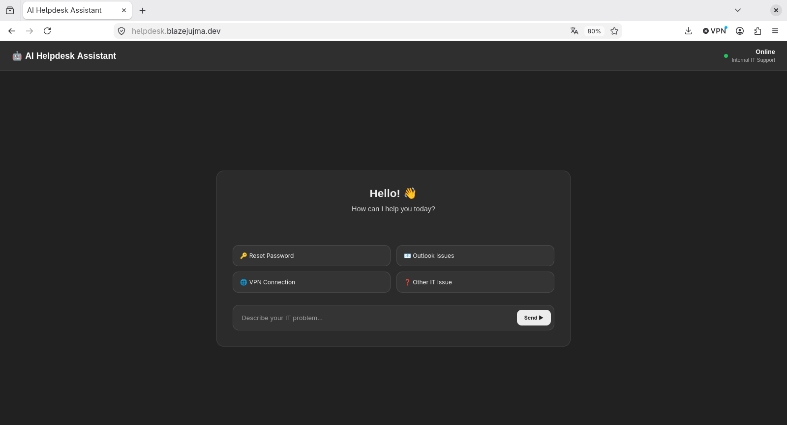
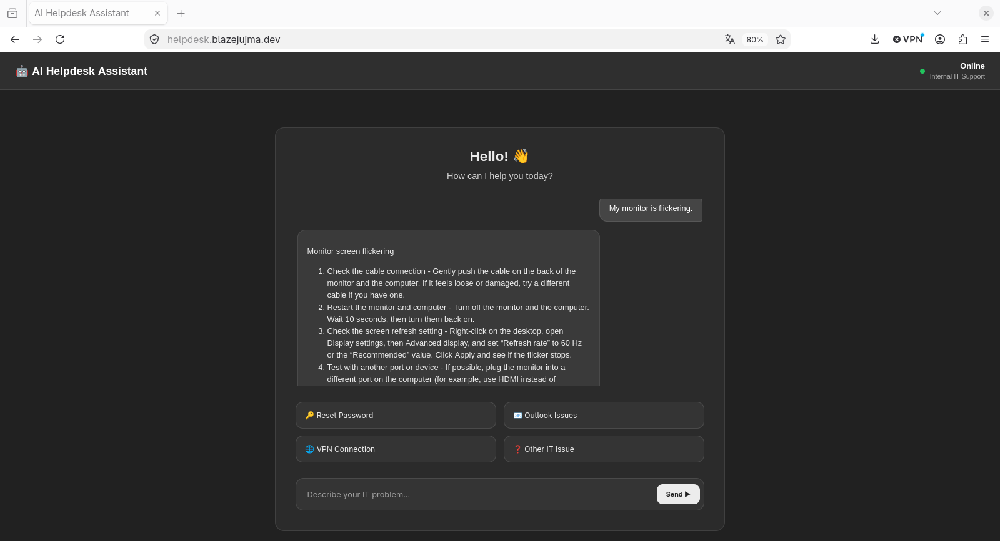
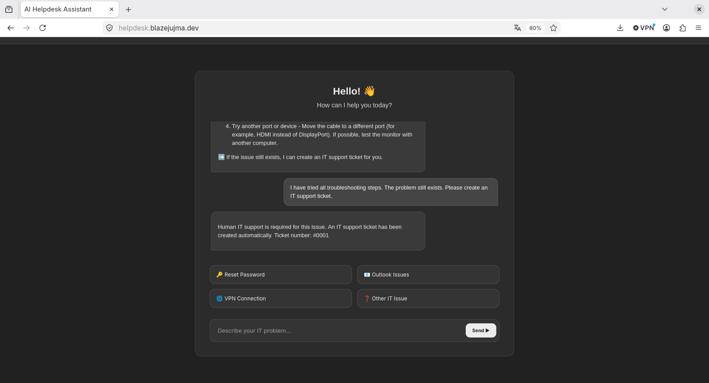

# AI Helpdesk Assistant

> **Status:** ✅ Live and publicly available

## Project Overview

The AI Helpdesk Assistant is a prototype of an intelligent internal IT support system.

The goal of the project is to answer common IT questions automatically, reduce repetitive helpdesk requests, and create support tickets whenever human assistance is required.

The application combines a local FAQ knowledge base with OpenAI GPT-5 to provide simple troubleshooting instructions for end users.

If an issue cannot be solved safely, the assistant automatically creates a local IT support ticket.

The project was developed as a learning project for my Boehringer Ingelheim IT apprenticeship presentation.

---

## 🌐 **Live Demo:** https://helpdesk.blazejujma.dev

The application is hosted on a Debian virtual machine running on my own Proxmox server and is securely published using Cloudflare Tunnel.

---

# 📸 Screenshots

### 🖥️ Desktop Interface



---

### 🤖 AI Conversation



---

### 🎫 Automatic Ticket Creation



---


## Technologies

### Backend

- Python
- FastAPI
- Uvicorn

### Frontend

- HTML
- CSS
- JavaScript

### AI

- OpenAI GPT-5
- Conversation Memory

### Data

- JSON Knowledge Base
- JSON Ticket System

### Deployment

- Debian 13
- Proxmox VE
- Cloudflare Tunnel
- systemd

### Version Control

- Git
- GitHub

---

## Features

- Modern responsive web interface
- FastAPI backend
- GPT-5 integration
- Conversation memory
- Local FAQ knowledge base
- Automatic FAQ search
- Automatic IT ticket creation
- Local JSON ticket storage
- Automatic fallback when the AI service is unavailable
- Public HTTPS deployment using Cloudflare Tunnel

---

## Architecture

```text
Internet
      │
https://helpdesk.blazejujma.dev
      │
Cloudflare
      │
Cloudflare Tunnel
      │
Debian 13 VM (Proxmox)
      │
FastAPI
      │
GPT-5 + FAQ + Ticket System
```

---

## Development Progress

Current project status:

- ✅ Responsive web interface
- ✅ FastAPI backend
- ✅ GPT-5 integration
- ✅ Conversation memory
- ✅ FAQ knowledge base
- ✅ Automatic ticket creation
- ✅ JSON ticket storage
- ✅ Debian deployment
- ✅ systemd service
- ✅ Cloudflare Tunnel
- ✅ Public HTTPS deployment

---

## Project Structure

```text
ai-helpdesk-assistant/

app/
├── knowledge/
│   └── faq.json
├── static/
│   ├── style.css
│   └── script.js
├── templates/
│   └── index.html
├── tickets.json
└── main.py

docs/
README.md
requirements.txt
Dockerfile
docker-compose.yml
```

---

## Purpose

This project demonstrates the development of a complete AI-powered web application including backend development, frontend development, AI integration, deployment, and Linux server administration.

It was created as part of my application for an IT apprenticeship at Boehringer Ingelheim.